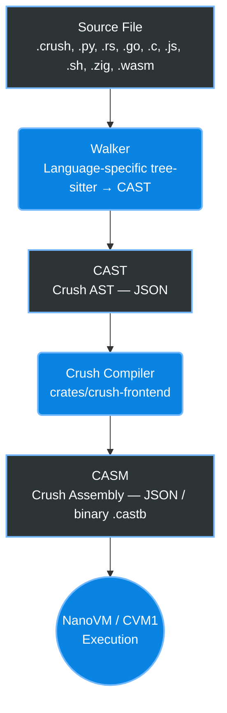

<p align="center">
  
</p>

<h1 align="center">
  
  Crush AST
</h1>

<p align="center">
  <strong>Polyglot Intermediate Representation & Toolchain</strong>
</p>

<p align="center">
  <a href="LICENSE-MIT"></a>
  
</p>

---

**Crush** is a capability-based, polyglot programming language and virtual runtime. This repository hosts the **standalone Crush implementation**: providing the CAST intermediate representation, tree-sitter grammar, polyglot walkers, compiler frontend, VM runtime, package manager, and installer.

## 🌌 Relationship to Exosphere

This repository was extracted from the [exosphere](https://github.com/nixpt/exosphere) agent-native OS monorepo on 2026-06-12. The walker crate tree (the polyglot source → CAST translators) was split out so it could compile independently without pulling in the full exosphere kernel runtime. Exosphere retains a subprocess-based `WalkerRegistry` that invokes the walker binaries produced here.

The repos are **peer projects** — no path dependencies run in either direction. Exosphere pins its own `crush-cast`/`casm` at v1.0.0; crush-ast's copies are at v0.2.0.

## 🏗️ Repository Structure

```text
crates/
├── crush-errors/       # Unified error types (leaf crate)
├── crush-cast/         # CAST — Crush Abstract Syntax Tree IR
├── casm/               # CASM — Crush Assembly bytecode format
├── tree-sitter-crush/  # Tree-sitter grammar for the Crush language
│
├── walker-core/        # Walker trait + BaseWalker utilities
├── cli/                # CLI that auto-detects language and dispatches walker
├── python_walker/      # Python → CAST
├── rust_walker/        # Rust → CAST
├── js_walker/          # JavaScript → CAST
├── go_walker/          # Go → CAST
├── c_walker/           # C → CAST
├── zig_walker/         # Zig → CAST
├── bash_walker/        # Bash → CAST
├── wasm_walker/        # WebAssembly → CAST
│
├── crush-frontend/     # Crush language parser, semantic analyzer, optimizer, and CASM compiler
├── crush-lang-sdk/     # Rust SDK for hosting the CVM1 runtime (produces: crushc, crush-run, crush-compile, crush-repl)
├── crush-vm/           # CVM1 bytecode assembler, disassembler, and sandboxed interpreter
├── crush-pkg/          # Package manager — cargo-like build tool for Crush
└── crush-installer/    # Toolchain installer and uninstaller
```

## 🚀 Quick Start

### Building from Source

Ensure you have Rust 1.85+ installed.

```bash
# Build the core SDK and package manager
cargo build -p crush-lang-sdk -p crush-pkg

# Install to ~/.crush using the included installer
cargo run --bin crush-installer -- install --bin-dir target/debug
```

### Running Directly

```bash
# Check compiler options
cargo run --bin crushc -- --help

# Run a Crush script directly
cargo run --bin crush-run -- my-program.crush
```

## ⚙️ Compilation Pipeline

The Crush pipeline seamlessly converts polyglot source code down to execution-ready bytecode through an interconnected set of stages.



## 📚 Documentation

- [The Crush Language Guide](https://github.com/nixpt/crush-language-guide) — Language reference, examples, CAST/CASM specifications.
- Comprehensive crate-level documentation is available in the respective `crates/*/README.md` files.

## ⚖️ License

Licensed under either of [MIT](LICENSE-MIT) or [Apache License 2.0](LICENSE-APACHE) at your option.

Unless you explicitly state otherwise, any contribution intentionally submitted for inclusion in this work shall be dual-licensed as above, without any additional terms or conditions.
